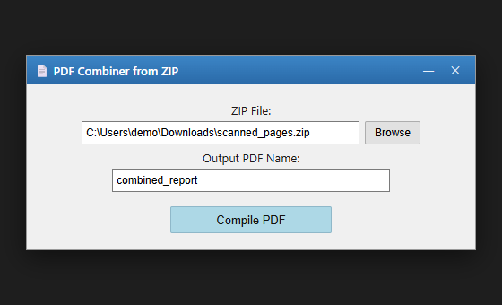
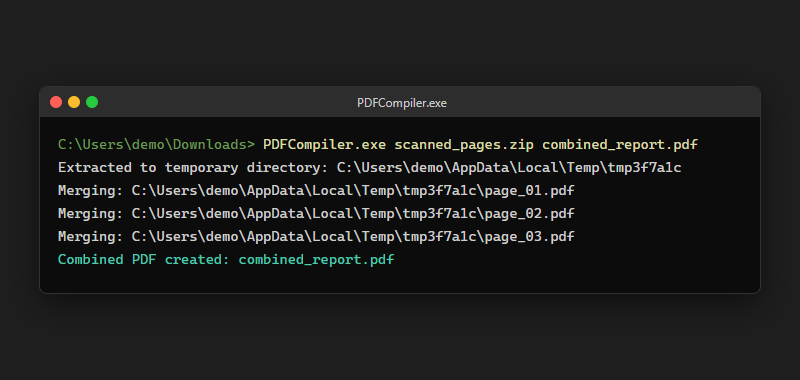

<p align="center"></p>

<p align="center">
  <b>Drop in a ZIP of scanned pages, get back one merged PDF — from the command line or a two-field GUI.</b>
</p>

<p align="center">
  
  
  
</p>

## ✨ What it does

- Takes a `.zip` of PDF files (e.g. a folder of scanned pages) and merges every PDF inside into one output file.
- Extracts the zip to a temporary directory, walks it recursively, and collects every file ending in `.pdf` — so PDFs nested in subfolders are picked up too.
- Sorts the found PDFs by path before merging, so page order is deterministic (rename your scans `01.pdf`, `02.pdf`, … to control the order).
- Ships two ways to run it: `PDFCompiler.py`, a 3-argument CLI, and `PDFCompilerGUI.py`, a small Tkinter window with Browse/Compile buttons and a save dialog.
- Both are wired up as PyInstaller `.spec` files, and this repo already carries built Windows executables in `dist/`.

## 🎬 See it

<table><tr>
<td width="50%"><br><sub>GUI layout diagram — drawn from <code>PDFCompilerGUI.py</code>, not a live window capture. The CLI shot on the right is the real program.</sub></td>
<td width="50%"><br><sub>The CLI — <code>PDFCompiler.py</code> / <code>PDFCompiler.exe</code></sub></td>
</tr></table>

## 🧠 How it works


Both entry points call the same logic: extract the zip into a `tempfile.TemporaryDirectory` (auto-deleted on exit), find every `.pdf` with `os.walk`, sort the paths, and feed them in order to [`PyPDF2.PdfMerger`](https://pypdf2.readthedocs.io/). The CLI writes straight to the path you pass in; the GUI opens a native "Save As" dialog for the output PDF instead.

## 🚀 Quick start

<table><tr>
<td valign="top" width="50%">

**Run the prebuilt executables** (already in `dist/`, Windows only)
```powershell
dist\PDFCompilerGUI.exe
# or, from a terminal:
dist\PDFCompiler.exe scanned_pages.zip combined_report.pdf
```

</td>
<td valign="top" width="50%">

**Run from source**
```bash
pip install PyPDF2
python PDFCompilerGUI.py
# or:
python PDFCompiler.py scanned_pages.zip combined_report.pdf
```

</td>
</tr></table>

There's no `requirements.txt` in the repo — `PyPDF2` is the only third-party dependency; `tkinter`, `zipfile`, `os` and `tempfile` are stdlib.

## 🗂️ Project layout

```
PDFCompiler.py         # CLI: python PDFCompiler.py <zip> <output.pdf>
PDFCompilerGUI.py       # Tkinter GUI wrapping the same merge logic
PDFCompiler.spec        # PyInstaller spec → dist/PDFCompiler.exe (console)
PDFCompilerGUI.spec     # PyInstaller spec → dist/PDFCompilerGUI.exe (windowed)
dist/                   # committed, prebuilt .exe files
build/                  # committed PyInstaller build artifacts
```

## 🧰 Stack

| Layer | Choice | Why |
|---|---|---|
| Language | Python 3 | Small, single-purpose script — no need for anything heavier |
| PDF merge | [PyPDF2](https://pypdf2.readthedocs.io/) `PdfMerger` | One call per file, handles the actual PDF-level merge |
| GUI | Tkinter (stdlib) | Ships with Python, no extra install for a two-field form |
| Packaging | PyInstaller | Turns each entry point into a standalone Windows `.exe` |

## 🗺️ Status & roadmap

- ✅ CLI merge from a zip, sorted by filename
- ✅ GUI with file picker, save dialog, and error messages for bad input
- ✅ Prebuilt Windows executables committed in `dist/`
- 🔜 No `requirements.txt` / pinned dependency version yet
- 🔜 No page-order control beyond filename sort (no drag-to-reorder)

## 🤝 Contributing / 📄 License

No `CONTRIBUTING` guide or `LICENSE` file yet — open an issue or PR if you'd like to use or extend this.

<p align="center"><sub>Built by <a href="https://github.com/ChinmayGit8765">Chinmay</a> · part of the <a href="https://chinmaygit8765.github.io/exaryn-studio/">Exaryn</a> studio</sub></p>
